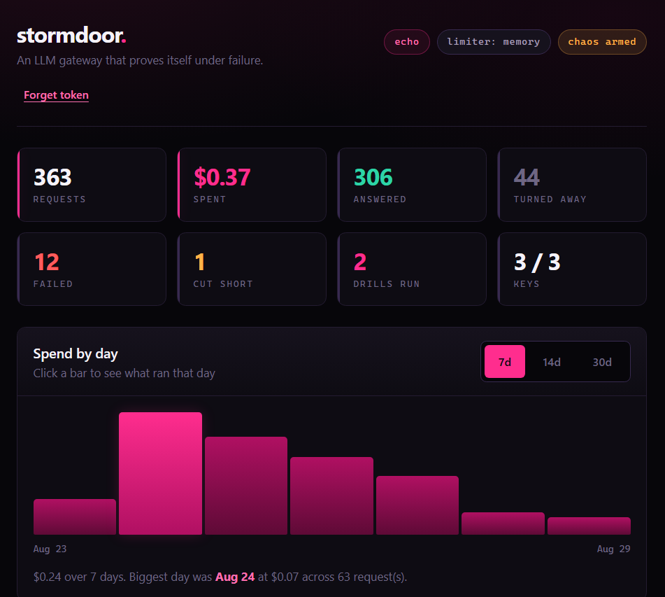
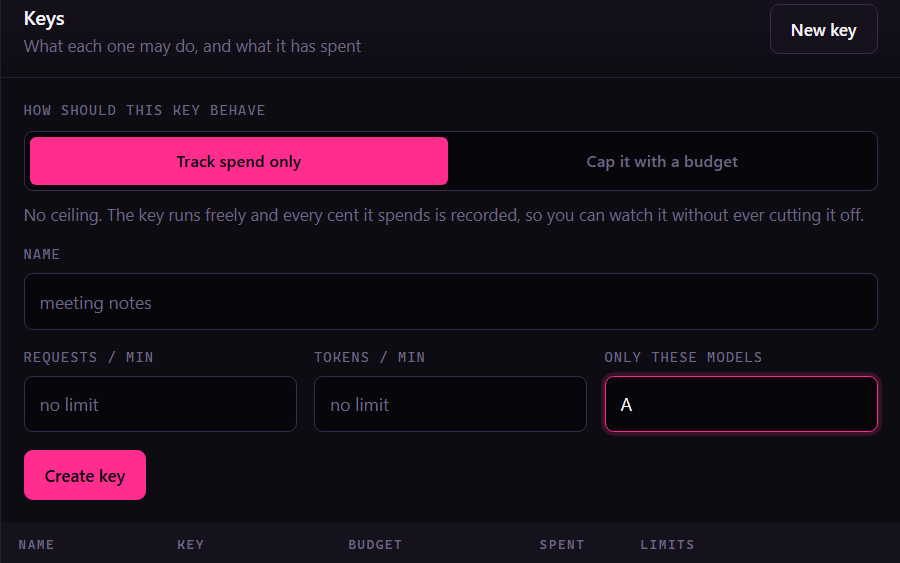
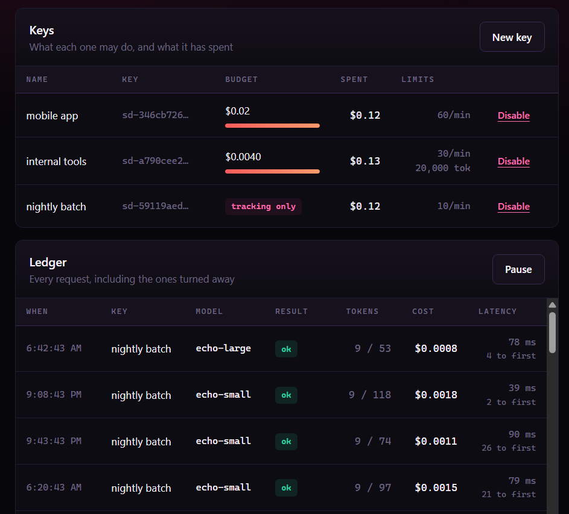
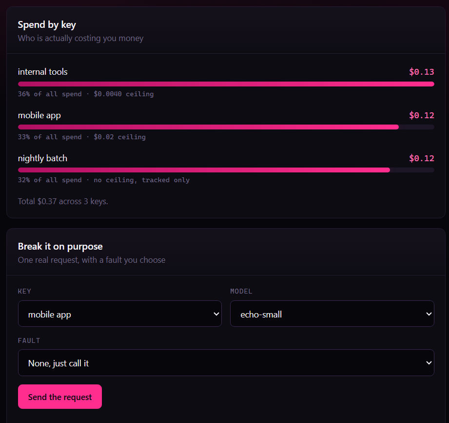
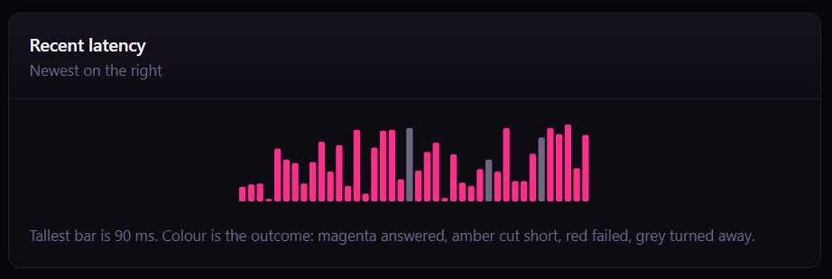

# stormdoor

[](https://github.com/DINAKAR-S/stormdoor/actions/workflows/ci.yml)
[](LICENSE)
[](https://www.python.org/downloads/)

**An LLM gateway that proves itself under failure.**

A storm door is the outer door that takes the weather so the real one does not.
This is that, in front of your models: one OpenAI-compatible endpoint, virtual
keys, hard budgets, rate limits, and a usage ledger you can bill from.

There are good gateways already. What none of them ship is a way to make the
provider fail on purpose, against your own traffic, and watch what your gateway
actually does. That is the part of a gateway that matters, and it is the part
nobody tests, because provoking a real 503 or a real mid-stream disconnect is
inconvenient. So stormdoor injects them for you, and every reliability claim in
this README is produced by a harness in `bench/` that you can rerun.

> **Status: week 2 of a public build, and honest about it.** What works and is tested: providers,
> streaming, virtual keys, budgets, rate limits, fault injection, the ledger, the
> dashboard, and routing with retries, circuit breaking and failover. Caching,
> guardrails and tracing are not there. See the [build log](#build-log) and
> [what is not built yet](#what-is-not-built-yet).



Every request that goes through the gateway, what it cost, and which day cost
the most. Click a day and everything below filters to it.

---

## The problem, in one story

You have four things calling OpenAI: a meeting notes app, an n8n workflow, a
customer chatbot, and a nightly batch job. All four hold a copy of the same API
key, because that was the fastest thing to do at the time.

On Tuesday the batch job gets stuck in a retry loop and spends $400 overnight.
You find out when the invoice arrives. Nothing stopped it, because nothing was
watching, and the provider dashboard shows you one number for all four, so you
cannot even tell which one did it without going and adding logging to each.

Put stormdoor in front and each of the four gets its own key with its own
ceiling:

```bash
stormdoor keys create meeting-notes --budget 30 --rpm 120
stormdoor keys create n8n-workflows --budget 10 --rpm 60
stormdoor keys create support-chat  --budget 50 --rpm 300
stormdoor keys create nightly-batch --budget 20 --rpm 30
```

Now the batch job hits its own $20 ceiling at 2am and starts getting 402s. The
other three carry on, because a budget belongs to a key and not to the account.
In the morning the ledger tells you which key, which model, how many tokens, and
what each request cost.

Inside the four apps, two lines changed: `base_url` and `api_key`. Everything
else is the same, because stormdoor speaks the OpenAI API.

### What this makes easy

| Situation | Without a gateway | With stormdoor |
|---|---|---|
| One project runs away with your money | You find out from next month's invoice | It hits its own ceiling and stops. The rest keep working |
| A key ends up in a git commit | Rotate the provider key, then update all four apps | Disable that one virtual key. The provider key never moved |
| Someone asks what the chatbot costs | Export the invoice and estimate | One ledger query, per key, per model |
| A contractor needs access for two weeks | Hand over the real key and hope | Mint a key with $5 and 10 rpm, disable it when they leave |
| You want a model you have not used before | Another SDK, another key, another code path | Same endpoint, change the model string |
| The provider has a bad hour | Find out from your users | Rehearse it first, on purpose, and know what your app does |

That last row is the one this project is actually about. Everything above it,
other gateways do too.

---

## Run it in sixty seconds

No Docker. No Postgres. No Redis. No API key.

```bash
git clone https://github.com/DINAKAR-S/stormdoor && cd stormdoor
uv venv && uv pip install -e ".[dev]"
```

Mint a key and start the gateway with fault injection turned on:

```bash
uv run stormdoor keys create demo --budget 5 --rpm 60 --tpm 20000
```

```bash
uv run stormdoor serve --chaos
```

Open [localhost:8080](http://localhost:8080). The dashboard asks for an admin
token. To find it:

```bash
uv run stormdoor admin-token
```

That prints it and stays the same across restarts. The gateway also prints it in
a banner the first time it starts. If you would rather choose it yourself, set
`STORMDOOR_ADMIN_TOKEN` and that wins; `stormdoor admin-token --reset` replaces
a stored one.

Signed in, you get every key and what it has spent, spend by day with the
expensive day called out, a live ledger, and a dropdown that breaks the gateway
on purpose.

Or talk to it like any OpenAI endpoint. `echo-small` is a local, deterministic
model that never leaves the process, so everything below is free:

```bash
curl localhost:8080/v1/chat/completions -H "Authorization: Bearer sd-..." -H "Content-Type: application/json" -d '{"model":"echo-small","messages":[{"role":"user","content":"hello"}]}'
```

Now break it on purpose:

```bash
curl localhost:8080/v1/chat/completions -H "Authorization: Bearer sd-..." -H "X-Stormdoor-Chaos: fault=mid_stream_abort;after_chunks=5" -H "Content-Type: application/json" -d '{"model":"echo-small","stream":true,"messages":[{"role":"user","content":"hello"}]}'
```

Five chunks arrive, then an SSE `error` event. Read the ledger and the request
is recorded as `aborted`, not as a success and not as a total failure, with the
tokens that were actually produced charged to the key:

```bash
uv run stormdoor keys usage <key_id>
```

---

## Why this exists

A gateway is bought for what it does on the bad day. Yet the normal way to gain
confidence in one is to read its feature list. Fault injection here is a
first-class part of the product rather than a test fixture, which means:

- You can rehearse a provider outage against **your** traffic, on a Tuesday.
- Retry, failover and timeout behaviour can be asserted in CI rather than
  discovered in production.
- A fault takes a `seed`, which fixes whether that request fails, so a drill
  becomes a regression test instead of a flaky one. Leave the seed off when you
  want a fault rate spread across many requests rather than one fixed outcome.

Faults are refused unless `STORMDOOR_CHAOS_ENABLED=true`. While it is off, the
header is not even parsed, so a caller cannot induce failures in a deployment
you did not arm.

| Fault | What it does |
|---|---|
| `error` | Fails before the upstream call, with a status code you choose |
| `timeout` | Hangs past the request timeout |
| `slow` | Delays, then proceeds, for time-to-first-token work |
| `mid_stream_abort` | Streams N chunks, then dies mid-response |

```
X-Stormdoor-Chaos: fault=error;status=503;p=1.0
X-Stormdoor-Chaos: fault=mid_stream_abort;after_chunks=5
X-Stormdoor-Chaos: fault=slow;delay_ms=800;p=0.25;seed=7
X-Stormdoor-Chaos: fault=error;status=503;target=openai/gpt-4o-mini
```

`target` aims the fault at one provider and model. Without it the fault hits
every target in a fallback chain equally, so the only outage you can rehearse is
"everything is down", which is the least interesting one and the only case where
failover has nowhere to go.

Every injected fault is tagged in the ledger, so a drill is never confused with
a real outage when you read the history back.

### What a drill actually looks like

It is Friday. You want to know what your chatbot does when the provider starts
returning 503 to a quarter of your calls, without waiting for the day it
happens. So you make it happen:

```bash
curl localhost:8080/v1/chat/completions \
  -H "Authorization: Bearer sd-..." \
  -H "X-Stormdoor-Chaos: fault=error;status=503;p=0.25" \
  -H "Content-Type: application/json" \
  -d '{"model":"echo-small","messages":[{"role":"user","content":"hi"}]}'
```

Run your own traffic through that for ten minutes and you learn things you
cannot learn from a feature list. Does the app retry, or show the user a stack
trace? Does the retry have a backoff, or does it hammer a provider that is
already struggling? Does anything alert, or does it fail silently? Does a failed
call still get billed to the right key?

Then the harder one, the failure most code has never been tested against: the
provider accepts the request, streams half an answer, and dies.

```bash
-H "X-Stormdoor-Chaos: fault=mid_stream_abort;after_chunks=5"
```

The HTTP status was already 200 before anything went wrong, so a client that
only checks status codes thinks this succeeded and shows the user half a
sentence. stormdoor sends an SSE `error` event, records the request as
`aborted` rather than as a success, and bills the tokens that really were
produced. Your client's job is to notice. This is how you find out whether it
does.

---

## What it does today

**One endpoint, many providers.** `POST /v1/chat/completions`, streaming and
non-streaming, in front of Anthropic, OpenAI (or anything OpenAI-compatible:
vLLM, Ollama, Groq, Together, OpenRouter), and a local `echo` provider. Model
ids route by prefix, so a model released after this code was written still
works instead of 404-ing against a hardcoded list.

**Virtual keys.** Issued by the gateway, never the provider's key. Only a
SHA-256 hash is stored. Each key carries its own budget, request and token
rate limits, model allow-list, and expiry.

**Budgets enforced before the call, not after it.** Most gateways total up
spend retrospectively, which means the request that broke the budget already
cost you money. stormdoor prices the worst case a request could cost, using the
prompt length and `max_tokens`, and refuses it with a 402 that shows its
working:

```json
{"error": {"message": "this request could cost up to $0.1024, which would take key 'demo' past its $5.00 budget ($4.9891 already spent)",
           "type": "insufficient_quota", "code": "budget_exceeded",
           "budget": {"spent_usd": 4.9891, "budget_usd": 5.0, "estimated_cost_usd": 0.1024}}}
```

**Token-bucket rate limits.** Per key, on requests and on tokens, with bursts.
In-process by default; Redis when you have more than one replica, with the
refill and the take inside one Lua script so two replicas cannot both spend the
last token.

**An append-only ledger.** One row per request including refusals, errors and
half-finished streams, with tokens, cost, latency, time-to-first-token, and any
injected fault. Rows are never updated or deleted. The running spend on a key
moves in the same transaction as the row that caused it.

**Streaming with event ids.** Every SSE frame carries an `id:`. Nothing reads
it yet. It is the anchor a `Last-Event-ID` resume needs, and adding it now costs
one line where retrofitting it later would change the wire format under existing
clients.

**Routing, retries and circuit breaking.** A model name can map to an ordered
list of targets. Retryable failures are retried with jittered backoff then handed
down the chain; a target that fails three times in a row is skipped until a probe
says it recovered. See [When a provider goes down](#when-a-provider-goes-down).

**A dashboard, in one file.** Served at `/`, no build step, no framework, no web
font, and no external request of any kind, which a test enforces. Gateway-wide
counters, keys with their budget bars, spend by key, **spend by day with the
most expensive day called out**, a live ledger of every request including the
refused ones, a latency strip coloured by outcome, a provider health panel showing
which circuits are open, and a panel that fires one real request through the real
path with a fault of your choosing. Click any day
in the chart and the ledger filters to it, so "what did we actually run on the
day that cost the most" is one click rather than a query. It talks to the same
admin API the CLI does, so there is nothing in it you could not do with curl.

**You do not have to cap a key to watch it.** A budget is optional and always
was, but the dashboard makes it a choice you make on purpose: *track spend only*,
or *cap it with a budget*. Track-only keys run without a ceiling and every cent
they spend is still recorded, which is the right setting when what you want is to
find out what something costs before you decide what it is allowed to cost.



Keys and the live ledger side by side. The `tracking only` pill is a key with no
ceiling, deliberately, rather than a budget somebody forgot to fill in:



Which key is actually costing you money, and the panel that breaks the gateway
on purpose:



Latency of recent requests, coloured by what happened to each one:



---

## Two rules this codebase holds to

**A rate that is not sourced is not shipped.** Every entry in the rate card in
`src/stormdoor/pricing.py` carries where it came from and the date it was
checked. A model with no verified rate is recorded at `$0.00` with
`pricing_known = false` and logged as a warning, never quietly estimated. A
guessed rate produces an invoice that is wrong in a way nobody notices until
the customer notices. Override the whole table with `STORMDOOR_PRICING_FILE`.

**Estimates gate, they never bill.** Admission uses a local heuristic of about
four characters per token, which is fine for deciding whether to make a call
and useless for charging for one. Cost always comes from the token counts the
provider returns.

---

## When a provider goes down

A route turns one model name into an ordered list of targets. Ask for the route
and the gateway tries them in order, skipping anything it already knows is down.

```json
{
  "support-chat": {
    "targets": ["claude-haiku-4-5", "claude-sonnet-5", "openai/gpt-4o-mini"]
  }
}
```

Point `STORMDOOR_ROUTES_FILE` at that and call `support-chat` as the model. When
the first target starts returning 503, the second answers and your caller is not
told anything happened. The response says what really occurred:

```json
"stormdoor": {
  "served_by": "anthropic/claude-sonnet-5",
  "failed_over_from": "anthropic/claude-haiku-4-5",
  "tried": 2
}
```

**Three rules decide what happens**, and the middle one is the one that is easy
to get wrong.

- A **retryable** failure (429, 5xx, a timeout, a dropped connection) is retried
  against the same target with exponential backoff and full jitter, then handed
  to the next target. Jitter is not a detail: without it, everyone who failed at
  the same moment retries at the same moment and a provider that was merely
  struggling gets a second identical spike.
- A **non-retryable** failure (400, 401, 404) stops everything immediately. A
  malformed request will be malformed at every provider, so trying the rest of
  the chain turns one 400 into four, more slowly.
- After **three consecutive retryable failures** a target's circuit opens and it
  is skipped entirely, costing nothing instead of a timeout per request. One
  probe is let through after a cooldown to see if it recovered.

**A caller's bad request never opens a circuit.** Only retryable failures count.
Otherwise one person's malformed prompt, repeated a few times, would take a
working model away from everybody else on the gateway.

### Starting at the right size

The other half of routing is not spending Opus money on "summarise this in one
line". A `complexity` route scores the request and starts at the cheapest tier
that suits it:

```json
{
  "support-chat": {
    "strategy": "complexity",
    "targets": [
      {"model": "claude-haiku-4-5", "tier": "cheap"},
      {"model": "claude-sonnet-5",  "tier": "deep"}
    ]
  }
}
```

Code in the prompt, a long prompt, a deep conversation, or a large `max_tokens`
all mean deep; a short single-shot request means cheap. Every decision carries
its reason, because a routing choice nobody can explain is a routing choice
nobody trusts. Send `X-Stormdoor-Tier: deep` to override it.

A tier decides where to *start*, never what is available. A cheap request still
escalates to a deep target when the cheap ones are down, or the fallback chain
would be shortest exactly when it is needed most.

### The limit worth knowing

**Failover works before the first token, and not after it.** Once words have
reached the caller, switching provider would stitch two models' output into one
answer and bill it as a single response. That is not a recovery, it is a lie
about what wrote the text. A stream that dies part way still ends honestly: an
SSE `error` event, recorded as `aborted`, billed for what was really produced.

---

## Naming a model

You put the model in the `model` field of the request, exactly where an OpenAI
client already puts it. Two spellings work, so you do not have to guess:

```json
{ "model": "gpt-4o-mini" }
{ "model": "openai/gpt-4o-mini" }
```

**Bare id.** Routed by prefix. This is the one to use most of the time, because
it means an existing OpenAI client works with no change but the base URL.

| You want | You write |
|---|---|
| An OpenAI model | `gpt-4o-mini`, `gpt-4o`, `o3-mini` |
| A Claude model | `claude-opus-5`, `claude-sonnet-5`, `claude-haiku-4-5` |
| The built-in local model | `echo-small`, `echo-large` |

Prefixes route as: `claude-` to Anthropic; `gpt-`, `o1`, `o3`, `o4` and
`chatgpt-` to OpenAI; `echo-` to the local provider. A model released after this
code was written still routes correctly, because the rule is the prefix and not
a hardcoded list.

**Provider-prefixed id.** `<provider>/<model>`, where provider is one of the
names in `GET /healthz`. Currently `anthropic`, `openai`, `echo`.

```json
{ "model": "anthropic/claude-opus-5" }
```

The prefix is stripped before the call, so upstream only ever sees the id it
knows, and the ledger records that id too. Reach for this form when:

- The bare name would not route. A local vLLM or Ollama server behind
  `STORMDOOR_OPENAI_BASE_URL` might serve `llama-3.1-70b`, which no prefix rule
  would ever guess. `openai/llama-3.1-70b` sends it there anyway.
- You want the routing to be obvious in the calling code rather than implied.

A key's model allow-list accepts either spelling, so allowing `gpt-4o-mini` does
not lock out someone who writes `openai/gpt-4o-mini`.

**Not sure what this gateway can route?** Ask it:

```bash
curl localhost:8080/v1/models -H "Authorization: Bearer sd-..."
```

That lists what each provider advertises. OpenAI models are not enumerated
locally, because the set depends on your account and, behind a custom base URL,
on somebody else's server. Send the id and it routes.

**Getting it wrong tells you how to get it right.** An unroutable model returns a
404 that names the registered providers and both spellings, rather than a bare
"model not found".

---

## Configuration

Everything takes a `STORMDOOR_` prefix, and `.env` is read if present.

| Variable | Default | What it does |
|---|---|---|
| `STORMDOOR_HOST` / `STORMDOOR_PORT` | `127.0.0.1` / `8080` | Bind address |
| `STORMDOOR_DB_PATH` | `./stormdoor.db` | Keys and ledger |
| `STORMDOOR_ADMIN_TOKEN` | generated and stored in the db | Guards `/admin/*`. Read it with `stormdoor admin-token` |
| `STORMDOOR_LIMITER_BACKEND` | `memory` | `memory` or `redis` |
| `STORMDOOR_REDIS_URL` | unset | Required for the redis limiter |
| `STORMDOOR_CHAOS_ENABLED` | `false` | Arms fault injection |
| `STORMDOOR_CHAOS_DEFAULT` | unset | A spec applied to every request |
| `STORMDOOR_DEFAULT_MAX_TOKENS` | `4096` | Sent when the caller omits it |
| `STORMDOOR_PRICING_FILE` | unset | JSON rate card override |
| `STORMDOOR_ROUTES_FILE` | unset | Fallback chains. Without it a model means itself |
| `STORMDOOR_FAILOVER_ENABLED` | `true` | Off makes the gateway try only the first target |
| `STORMDOOR_MAX_RETRIES` | `2` | Retries against one target before moving on |
| `STORMDOOR_BREAKER_FAILURE_THRESHOLD` | `3` | Consecutive retryable failures before a circuit opens |
| `STORMDOOR_BREAKER_COOLDOWN_S` | `30` | How long a circuit stays open before one probe |
| `STORMDOOR_ANTHROPIC_API_KEY` | unset | Falls back to the SDK's own resolution |
| `STORMDOOR_OPENAI_API_KEY` / `..._BASE_URL` | unset | Also serves OpenAI-compatible servers |

### A note on `default_max_tokens`

Worst-case admission prices `max_tokens`, so the default the gateway sends on
behalf of a caller who omitted it directly determines how strict budgets feel.
At 64k, a single request against Claude Opus prices at over a dollar and a
small budget refuses everything. 4096 keeps admission useful. Callers who want
more room say so in the request.

---

## API

| Route | Auth | Purpose |
|---|---|---|
| `POST /v1/chat/completions` | `Authorization: Bearer sd-...` | Chat, streaming or not |
| `GET /v1/models` | key | What this gateway can route |
| `GET /healthz` | none | Providers, limiter, whether chaos is armed |
| `GET /dashboard` | token entered in the page | The dashboard. `/` redirects here |
| `POST /admin/keys` | `X-Stormdoor-Admin` | Issue a key, secret returned once |
| `GET /admin/keys` | admin | List keys with spend |
| `GET /admin/keys/{id}/usage` | admin | Totals and recent requests |
| `POST /admin/keys/{id}/disable` | admin | Kill a key immediately |
| `GET /admin/ledger` | admin | Recent requests, optionally `?day=YYYY-MM-DD` |
| `GET /admin/stats` | admin | Gateway-wide counters |
| `GET /admin/spend` | admin | Daily spend and the peak day, `?days=` and `?day=` |
| `GET /admin/health` | admin | Circuit state per target, and the routes behind it |
| `POST /admin/breaker/reset` | admin | Force a target back to closed |
| `POST /admin/drill` | admin | Fire one request, optionally with a fault |

Errors keep the OpenAI envelope (`{"error": {"message", "type", "code"}}`) so
an existing SDK's error handling still works, with the extra fields that
explain the decision: `retry_after_s` and `limit` on a 429, the budget
arithmetic on a 402, `retryable` and `provider` on an upstream failure.

---

## Proof

Numbers, not adjectives. Regenerate all of it on your own machine:

```bash
uv run python -m bench.harness
```

Six drills against the local `echo` provider, so no API key, no network and no
cost. The harness rewrites the section below with what it measured, and it is
also a gate: timings vary by machine and are never asserted, but the behaviour
behind them is. No overspend, every injected failure classified honestly, every
killed stream accounted for. If one of those stops holding, the harness exits
non-zero and CI goes red.

There is a second harness that runs before anything is published:

```bash
uv run python -m bench.stress
```

That one is adversarial rather than descriptive. It pushes concurrency, hostile
input, an empty database, a restart, a dead provider and a ledger with history
in it, and it has already earned its place: it caught a budget that overshot its
ceiling by **650%** when sixty requests arrived at once, which every unit test in
the suite was passing straight over.

<!-- BENCH:START -->
Generated by `uv run python -m bench.harness` on CPython 3.11.0, Windows AMD64. Local `echo` provider, so no network and no API key are involved.

### Throughput and latency

| Measure | Value |
|---|---|
| Requests | 600 |
| Concurrency | 32 |
| Successful | 600 / 600 |
| Throughput | 65 req/s |
| Latency p50 | 409.7 ms |
| Latency p95 | 655.8 ms |
| Latency p99 | 869.4 ms |
| Transport | in-process ASGI |

Full gateway path per request: auth, model check, both rate-limit buckets, budget admission, provider call, ledger write. The provider is local and the transport is in-process, so this isolates the gateway's own overhead from both the model's speed and the socket. Add your network and your model on top.

- PASS: every request under load succeeded

### Streaming, time to first token

| Measure | Value |
|---|---|
| Streams | 120 |
| Transport | real uvicorn server over TCP |
| Simulated per-chunk delay | 4 ms |
| TTFT p50 | 26.8 ms |
| TTFT p95 | 35.5 ms |
| Full response p50 | 68.8 ms |
| First word arrives after | 39.0% of the total wait |

Measured from request start to the first frame carrying content, which is the number a user perceives as the model's speed. The gateway pays its overhead once, at the front, and then gets out of the way of the stream.

- PASS: the first token arrives before the response finishes

### Injected provider outage

| Measure | Value |
|---|---|
| Requests | 400 |
| Fault rate requested | 25% |
| Observed 503s | 389 (97.2%) |
| Succeeded anyway | 11 |
| Marked retryable | 389 / 389 |
| Ledger rows tagged as a drill | 389 |

Every failure is tagged in the ledger with the fault that caused it, so a rehearsal is never mistaken for a real outage when the history is read back. The retryable flag is what the routing layer acts on.

- PASS: the injected outage actually fired
- PASS: every injected 503 was marked retryable
- PASS: every failure reached the ledger

### Death mid-stream

| Measure | Value |
|---|---|
| Streams killed | 60 |
| HTTP status seen by caller | 200, the headers were already sent |
| Content chunks delivered first | 3 to 3 |
| Streams that signalled the failure | 60 / 60 |
| Recorded as aborted, not as success | 60 |
| Recorded as success | 0 |

The hardest partial failure to handle honestly. The status line has already said 200, so the error has to travel inside the stream, and the caller has to be charged for the tokens that really were produced. Neither a success nor a total failure, and the ledger says so.

- PASS: every killed stream told the caller why
- PASS: partial output reached the caller first
- PASS: no killed stream was recorded as a success
- PASS: every killed stream was recorded as aborted

### Budget admission

| Measure | Value |
|---|---|
| Budget | $0.50 |
| Requests attempted | 40 |
| Admitted | 18 |
| Refused with 402 | 22 |
| Final spend | $0.4860 |
| Overspend | $0.0000 |
| Cost of a refused request | $0.0000, no upstream call is made |
| Refusals recorded | 22 |

Refusal happens before the provider is called, so a request that would break the budget costs nothing but a SQLite write. The ceiling holds under concurrency too, because admission claims the worst case atomically rather than reading a spend figure other in-flight requests are about to change. See the note below for the one case where it can still be beaten.

- PASS: the budget admitted work before it closed
- PASS: the budget eventually closed the door
- PASS: spend never passed the ceiling
- PASS: every refusal reached the ledger

### Rate limiting

| Measure | Value |
|---|---|
| Limit | 30 requests/min |
| Fired at once | 60 |
| Allowed as a burst | 30 |
| Throttled with 429 | 30 |
| Retry-After given | 2 s |
| Throttled requests recorded | 30 |

A bucket holds a full minute's allowance, so the first 30 arrive together and are all served. Real traffic is bursty, and a limiter that rejects a burst it could have absorbed is an outage you built yourself.

- PASS: the full burst was allowed through
- PASS: everything past the burst was throttled
- PASS: every 429 carried a wait time

### An outage, with failover off and on

| Measure | Value |
|---|---|
| Requests, each run | 300 |
| Outage | the first target in the chain returns 503 to everything |
| Succeeded with failover off | 0 (0.0%) |
| Succeeded with failover on | 300 (100.0%) |
| Difference | 100.0 points |

Same injected outage both times, so the difference is the feature and not the weather. With failover off every request fails, because the target it was told to use is down. With it on the second target answers and the caller is never told anything went wrong. After three consecutive failures the first target's circuit opens and it stops being tried at all, so the later requests do not even spend an attempt on it.

- PASS: the outage reaches the caller when failover is off
- PASS: the caller never sees the outage when failover is on

### Where the budget ceiling does not hold

One honest limit, worth stating because a guarantee with unstated conditions is a lie with good manners. Admission prices the prompt with a local heuristic of about four characters per token, and that heuristic undershoots on code, CJK text and base64, so a real provider can bill more input than was estimated. The overshoot is bounded by that estimation error on a single request.

The larger gap is closed. Admission used to read the spend and then decide, which is a check-then-act race: `bench/stress.py` fired sixty requests at a $0.20 key at once and watched it spend $1.50, a 650% overshoot. Admission now claims the worst case atomically before the call and settles it against the real cost afterwards, in the same transaction as the ledger row. The same drill now overshoots by $0.00. A crash mid-request would strand a claim, so every reservation on disk is cleared at startup, when by definition nothing is in flight.
<!-- BENCH:END -->

---

## Self-hosting

One provider key on your server, one virtual key per project, one ledger that
tells you what each project spent. [docs/deploy.md](docs/deploy.md) is the full
recipe: Docker Compose, minting a key per project, wiring n8n in through a
Header Auth credential, and a Caddy config that exposes `/v1` to the world while
keeping `/admin` and the dashboard off it.

```bash
docker compose up -d --build
```

---

## Build log

Built in the open, a week at a time. Weeks 1 and 2 are what the code does today.
The rest is intent, not a promise with a date on it.

| Week | Status | What landed |
|---|---|---|
| 1 | **done** | Providers, streaming, virtual keys, budgets with atomic reservations, rate limits, fault injection, the ledger, the dashboard |
| 2 | **done** | Routes and fallback chains, retries with jittered backoff, circuit breakers per target, complexity-based tier routing, provider health |
| 3 | next | Semantic cache, PII redaction and prompt-injection filtering as request hooks |
| 4 | planned | OpenTelemetry tracing, usage-based billing export, SSE resume across a mid-stream failure |

---

## What is not built yet

Listed because a gateway's missing pieces matter more than its present ones, and
because you should not find out from a 500.

| Not there | What that means for you today |
|---|---|
| Semantic caching | Two identical questions cost twice |
| Guardrails | No PII redaction and no prompt-injection filtering on the request path |
| Tracing | Per-request cost and latency are in the ledger, but there are no OpenTelemetry spans to join up with the rest of your system |
| Mid-stream resume | A stream that dies after the first token stays dead. Failover only works before the first token, and the event ids needed to do better are in place but nothing reads them yet |
| Shared breakers | Circuit state is per process. Several replicas each learn from their own traffic rather than from each other |

---

## What this got wrong first

[docs/lessons.md](docs/lessons.md) is an honest log of the defects found while
building this: a budget that overshot its ceiling by 650% under concurrency
while every test passed, a dashboard that showed stale numbers as if they were
live once the gateway died, a benchmark that measured its own instrument, a CI
matrix that would have tested one Python version four times, a circuit breaker
that could never recover because ``0.0`` is falsy, and a feature flag that only
half turned its feature off.

None of them were found by the suite going red. All of them were found by
looking on purpose.

---

## Development

```bash
uv run pytest
```

```bash
uv run ruff check src tests bench
```

The gateway core in `src/stormdoor/gateway.py` has no idea it is behind HTTP,
so tests and the bench harness drive it directly. The `echo` provider is
deterministic, which is what lets the tests assert exact token counts instead
of ranges.

## Licence

MIT. See [LICENSE](LICENSE).
